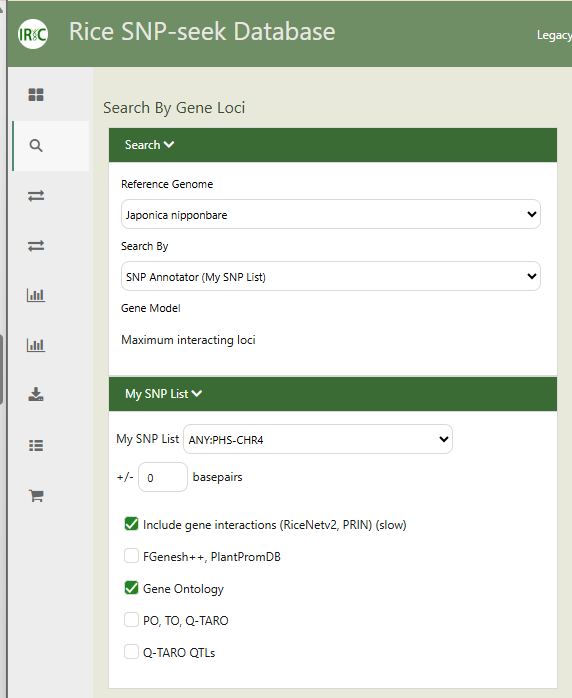

**SNPSeek v3 User Manual**

**QTL of Interest:
[<u>PHS</u>](https://www.mdpi.com/2223-7747/10/8/1709)**

**Publication:** Lee JS, Chebotarov D, McNally KL, Pede V, Setiyono TD,
Raquid R, Hyun WJ, Jeung JU, Kohli A, Mo Y. ***Novel Sources of
Pre-Harvest Sprouting Resistance for Japonica Rice Improvement**. Plants
(Basel). 2021 Aug 19;10(8):1709. doi: 10.3390/plants10081709. PMID:
34451754; PMCID: PMC8401653.*

# User Login

1.  Login using your SNP-seek credentials. There are three ways to do
    this:

    1.  Username/email and Password

    2.  Sign in using your Google account

    3.  Sign in using [<u>cgiar.org</u>](http://cgiar.org) (if you are
        part of this domain)

2.  Sign up if you do not have an account in SNPSeek yet.

# Search Genotypes:

> Note that our QTL/trait of interest is in this region:
> **<u>Chr4:4662701-4670717</u>**
>
> You can begin by searching for SNPS that lie within this region using
> the 3k rice dataset. There are 4 SNP Sets available:

- **<u>3K All</u>:** 32 million full 3K RG SNPs Dataset

> This SNP Set contains the full set of 32 million biallelic &
> multiallelic SNP.
>
> Total SNPs: 32,064,217
>
> Samples : 3024

- **<u>3kbase</u>:** 18 million base SNP

> The Base SNP set of ~18 million SNPs was created from the ~29 million
> biallelic SNPs subset from the 32M full SNP set by removing SNPs with
> excess of heterozygous calls.

- **<u>3K core</u>**: 404k CoreSNP dataset

> The Core SNP set was obtained from the filtered SNP set by applying
> two-step LD pruning procedure as follows:

1.  LD pruning with window size 10kb, step 1 SNP, R2 threshold 0.8

2.  LD pruning with window size 50 SNPs, step 1 SNP, R2 threshold 0.8

- **<u>3k filtered</u>:** 4.8million filtered SNP dataset

> The filtered SNP set was obtained from the Base SNP set by applying
> the following filtering criteria:

1.  alternative allele frequency at least 0.01

2.  proportion of missing calls per SNP at most 0.2

> You may use different SNP sets but for this hands-on, we will use the
> **"3Kbase" SNP set.**
>
> In the Chromosome, put **"Chr4"**, in Start use **"4662701"** and end
> **"4670717".**
>
> Click **"Search"** to retrieve the positions within this region within
> the 3KRG accessions.

Knowledge Check: How many SNPs were retrieved within the given region?

# Query result

> After querying the genotypes, you will have a table which displays the
> alleles for each 3KRG variety in a row, for all SNP positions within
> the specified region or gene. By default, the varieties are sorted by
> decreasing number of allele mismatches. The resulting table can be
> filtered using any of the column values, and sorted based on any
> column value by clicking the column header.

It will also report a graph of the allele frequencies where you can
inspect the major and minor alleles per subpopulation for all SNP
positions from the query.

In another panel, you can also view the region in a genome browser.

# SNP Effects

> The Genotype query also returns a table containing the SNP effects
> detected on MSU gene models. This is calculated using the SNPEff
> program.

# Haplotype View

> Another view for the result of the genotype query is the Haplotype
> View. This allows us to know whether our haplotypes make sense.

> You should also see major grouping of alleles which contributes to the
> haplotype.

In this hands-on, you should see **3 major haplotype groups**.

Knowledge Check: How many varieties belong to each major haplotype
group?

# Downloading the results table

Download the table in "Plink" format by clicking on the "Plink" button.

> This will give you two files in a zipped folder: a ped and map file
> that by now you should be familiar with.
>
> The first few lines of your downloaded .map file should look like
> this:

\...

Likewise, the first few lines of your .ped file should be like this:

#  Add positions in my list

> From the map file, remove the middle columns such that only the 1st
> column and the last columns remain (chr, position).
>
> Go to "My lists". Select "SNP" in List Type. Click on "Create" to make
> a new list.
>
> Paste the chr-position table from the map file.
>
> You may tick the box on "Verify if SNP is in Variant set". However, in
> this hands-on, we will not do that since we know that these SNPs
> already came as a result of the genotype query.
>
>  style="width:3.08767in;height:5.14612in" />
>
> You will be able to see this new list on the left side of the panel.
>
>  style="width:2.79038in;height:3.70313in" />
>  style="width:2.34896in;height:3.6686in" />

# Annotate SNP List

> Next thing we want to do is to look for candidate genes within the QTL
> region in Nipponbare, go to "Search"-\> "Gene Loci".
>
> Set "Japonica nipponbare" as reference genome.
>
> Set "SNP Annotator (My SNP List)" in Search.
>
> Set "All" to search all Gene models available.
>
> Tick the box to "Include gene interactions (RiceNetv2, PRIN)" and
> "Gene Ontology" annotations. You may choose to add more to gather more
> annotations for this region.

The result should be a table which contains the annotations that can be
grouped by:

1.  Marker/Position

2.  Gene Locus

3.  QTL

>  style="width:6.5in;height:1.95833in" />

# Saving the Gene List

Save the list as "qDTF_genes"

> Go to "My Lists" and you should see 3 gene loci when you search under
> "Locus".

# Get Gene set/network

> Using the gene list we generated, we will now do a gene enrichment
> analysis to know if there are other genes previously reported that are
> associated with our QTL of interest.
>
> To do this, go to "Search"-\> "Gene Loci.
>
> Set as Reference genome: "Japonica Nipponbare".
>
> Set Search to: "Gene set/networks".
>
> Set Gene Models to: "All".
>
> Set the My Locus List to: "qDTF2_genes".
>
> Tick "Ricenetv2 direct neighbors" and "AgriGO".
>
> Click on "Gene set/enrichment".
>
>  style="width:6.5in;height:1.95833in" />
>
> Unfortunately, this query will not return any result. Click the "Go"
> button beside the Ricenet option and it will give us this message:
>
> *"No ROC analysis, because the valid query set size \< 4."*
>
> In this case, our query size is very small. You can explore nearby
> regions and see if there are existing gene networks reported by
> increasing the upper and lower bound positions.

To know more abouthow to use Rice SNPSeek, read the User's manual in the
Help section:
[*<u>https://snpseek.irri.org/\_help.zul</u>*](https://snpseek.irri.org/_help.zul)
